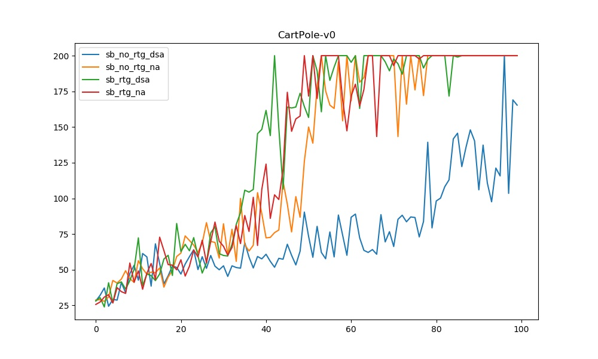
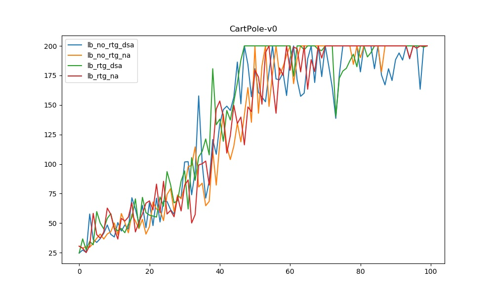
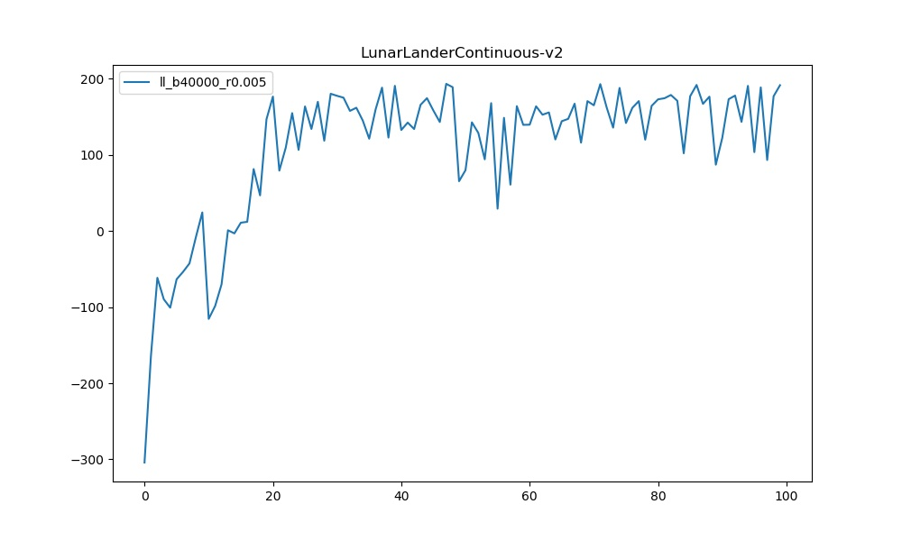
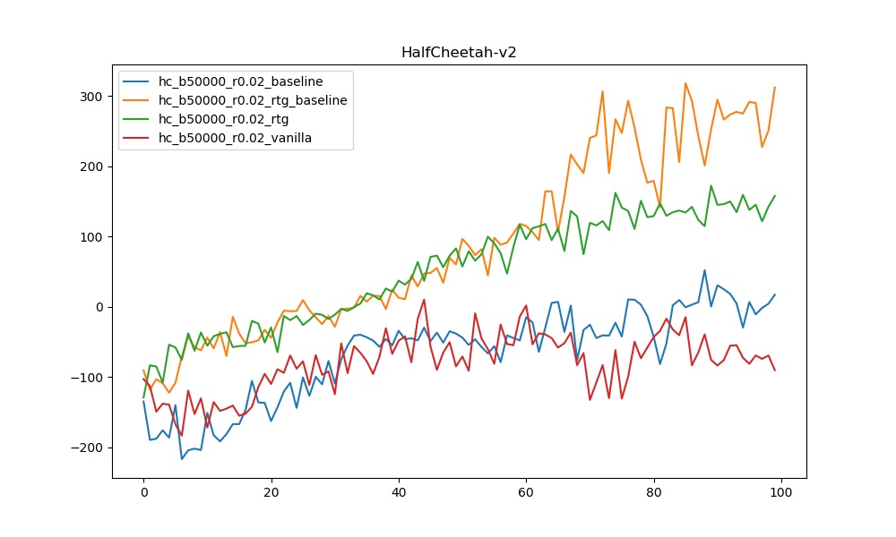
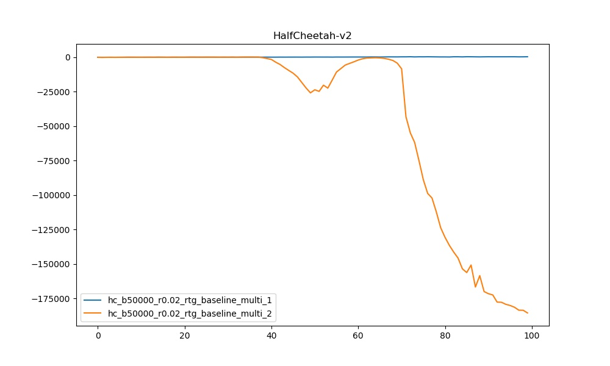
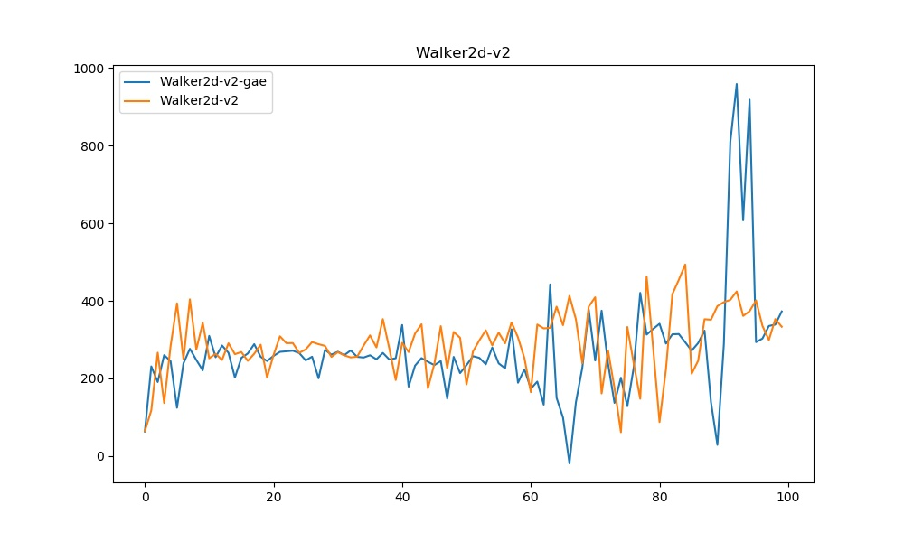

# CartPole-v0

```bash
# small batch, no standard advantages, no reward to go
python cs285/scripts/run_hw2_policy_gradient.py --env_name CartPole-v0 -n 100 -b 1000 --exp_name sb_no_rtg_dsa -l 1 -s 32 -dsa

# small batch, no standard advantages, reward to go
python cs285/scripts/run_hw2_policy_gradient.py --env_name CartPole-v0 -n 100 -b 1000 --exp_name sb_rtg_dsa -l 1 -s 32 -dsa -rtg

# small batch, standard advantages, no reward to go
python cs285/scripts/run_hw2_policy_gradient.py --env_name CartPole-v0 -n 100 -b 1000 --exp_name sb_no_rtg_na -l 1 -s 32

# small batch, standard advantages, reward to go
python cs285/scripts/run_hw2_policy_gradient.py --env_name CartPole-v0 -n 100 -b 1000 --exp_name sb_rtg_na -l 1 -s 32 -rtg
```



```bash
# large batch, no standard advantages, no reward to go
python cs285/scripts/run_hw2_policy_gradient.py --env_name CartPole-v0 -n 100 -b 5000 --exp_name lb_no_rtg_dsa -l 1 -s 32 -dsa

# large batch, no standard advantages, reward to go
python cs285/scripts/run_hw2_policy_gradient.py --env_name CartPole-v0 -n 100 -b 5000 --exp_name lb_rtg_dsa -l 1 -s 32 -dsa -rtg

# large batch, standard advantages, no reward to go
python cs285/scripts/run_hw2_policy_gradient.py --env_name CartPole-v0 -n 100 -b 5000 --exp_name lb_no_rtg_na -l 1 -s 32

# large batch, standard advantages, reward to go
python cs285/scripts/run_hw2_policy_gradient.py --env_name CartPole-v0 -n 100 -b 5000 --exp_name lb_rtg_na -l 1 -s 32 -rtg
```

​	


- Problem:

  - Which value estimator has better performance without advantage-standardization:
    the trajectory-centric one, or the one using reward-to-go?

    没有normalization的情况下，有reward to go的结果会更好；原因是reward to go是一个完全无害的trick，因为未来不会影响过去，不论未来sample如何变化，过去的（action, reward）pair是不会变化的，因此算上整条轨迹线的reward只是徒增了那一部分的乘子从而增大方差

  - Did advantage standardization help?

    是，normalize之后的Q value明显变得更小，loss和gradient的绝对值变得更小，对于本身方差就很大的gradient descent来说是控制方差的一个方法

  - Did the batch size make an impact?

    是，梯度的方向根据的更加准确了，但是绝对值变大的同时方差也变大了，但是从结果来看还是sample带来的方差更大


# InvertedPendulum

```bash
python cs285/scripts/run_hw2_policy_gradient.py --env_name InvertedPendulum-v2 --ep_len
1000 --discount 0.9 -n 100 -l 2 -s 64 -b 100 -lr 8e-3 -rtg --exp_name ip_b<100>_r<8e-3>
```


# LunarLander

```bash
python cs285/scripts/run_hw2_policy_gradient.py --env_name LunarLanderContinuous-v2 --ep_len 1000 --discount 0.99 -n 100 -l 2 -s 64 -b 40000 -lr 0.005 -rtg --nn_baseline --exp_name ll_b40000_r0.005}
```




# HalfCheetah

- Hyperparameter grid search
  - After hyperparameter grid search, you can find that larger batch size and larger learning rate will help to boost performance in this case.
  - Length of simple trajectory don't need to very long, as long as the total environment step of this batch is the same.

```bash
python cs285/scripts/run_hw2_policy_gradient.py --env_name HalfCheetah-v2 --ep_len 150 --
discount 0.95 -n 100 -l 2 -s 32 -b 50000 -lr 0.02 --video_log_freq -1 --reward_to_go --nn_baseline --exp_name hc_b<50000>_lr<r>_nnbaseline
```

- reward to go (causality) and baseline: ways to reduce variance

```bash
# vanilla policy gradient
python cs285/scripts/run_hw2_policy_gradient.py --env_name HalfCheetah-v2 --ep_len 150 --discount 0.95 -n 100 -l 2 -s 32 -b 50000 -lr 0.02 --exp_name hc_b50000_r0.02_vanilla

# with reward to go
python cs285/scripts/run_hw2_policy_gradient.py --env_name HalfCheetah-v2 --ep_len 150 --discount 0.95 -n 100 -l 2 -s 32 -b 50000 -lr 0.02 -rtg --exp_name hc_b50000_r0.02_rtg

# with baseline
python cs285/scripts/run_hw2_policy_gradient.py --env_name HalfCheetah-v2 --ep_len 150 --discount 0.95 -n 100 -l 2 -s 32 -b 50000 -lr 0.02 --nn_baseline --exp_name hc_b50000_r0.02_baseline

# with reward to go and baseline
python cs285/scripts/run_hw2_policy_gradient.py --env_name HalfCheetah-v2 --ep_len 150 --discount 0.95 -n 100 -l 2 -s 32 -b 50000 -lr 0.02 -rtg --nn_baseline --exp_name hc_b50000_r0.02_rtg_baseline
```



- the boost from NN-based baseline affects more when using reward-to-go


# Bonus 1: several iterations per batch

```bash
python cs285/scripts/run_hw2_policy_gradient.py --env_name HalfCheetah-v2 --ep_len 150 --discount 0.95 -n 100 -l 2 -s 32 -b 50000 -lr 0.02 -rtg --nn_baseline --exp_name hc_b50000_r0.02_rtg_baseline_multi_1 --num_agent_train_steps_per_iter 1

python cs285/scripts/run_hw2_policy_gradient.py --env_name HalfCheetah-v2 --ep_len 150 --discount 0.95 -n 100 -l 2 -s 32 -b 50000 -lr 0.02 -rtg --nn_baseline --exp_name hc_b50000_r0.02_rtg_baseline_multi_2 --num_agent_train_steps_per_iter 2
```



- Obviously, even just taking one mote step will result in disaster.
- In theory, policy gradient is an on-policy algorithms, because it represents its policy explictly. After running one gradient descent, the policy's distribution has changed, which is different from the sample distribution. That's why it won't work.
- Back to the curve, it doesn't differ so much at the beginning since policy tends to have more randomness in the beginning, which makes sense.


# Bonus 2: Genelized Advantage Estimation (GAE)

```bash
# we use lambda = 0.95
python cs285/scripts/run_hw2_policy_gradient.py --env_name Walker2d-v2 --discount 0.95 -n 100 -b 50000 -lr 0.01 -rtg --nn_baseline --exp_name Walker2d-v2

python cs285/scripts/run_hw2_policy_gradient.py --env_name Walker2d-v2 --discount 0.95 -n 100 -b 50000 -lr 0.01 -rtg --nn_baseline --exp_name Walker2d-v2-gae --use_gae
```




# Distributions and tf tricks

- tf.multinomial(logits)：

  - discrete action space sample distribution

  - logits每一行代表一个sample对应num_class个离散取值的概率（定义上和为1，但是这里不需要）

  - num_samples代表每一个sample采样几次

  - 多项式分布定义：

    - 如果一个随机向量X=(X1，X2，…，Xn)满足下列条件：

      (1)Xi≥0(1≤i≤n)，且X1+X2+…+Xn=N（总共采样N次）；

      (2)设m1，m2，…，mn为任意非负整数，且m1+m2+…+mn=N，则事件

      则{X1=m1，X2=m2，…，Xn=mn)的概率

  ```python
  tf.compat.v1.multinomial(
      logits,
      num_samples,
      seed=None,
      name=None,
      output_dtype=None
  )
  
  # samples has shape [1, 5], where each value is either 0 or 1 with equal
  # probability.
  samples = tf.random.categorical(tf.math.log([[0.5, 0.5]]), 5)
  ```

- tf.random_normal(mean, std)

  - continuous action space sample distribution

- tf.GPUOptions

  ```python
  gpu_options = tf.GPUOptions(
              per_process_gpu_memory_fraction=gpu_frac,
              allow_growth=allow_gpu_growth)
  ```

  - per_process_gpu_memory_fraction: limit the percentage a process can use in one GPU
  - allow_growth: True if you want to allocate GPU memory dynamically

- tf.ConfigProto

  ```python
  # use GPU
  config = tf.ConfigProto(
              gpu_options=gpu_options,
              log_device_placement=False,
              allow_soft_placement=True,
              inter_op_parallelism_threads=1,
              intra_op_parallelism_threads=1)
  # do not use GPU
  config = tf.ConfigProto(device_count={'GPU': 0})
  ```

  - log_device_placement: 是否打印设备分配日志
  - allow_soft_placement: 如果你指定的设备不存在，允许TF自动分配设备
  - device_count: dict of device counts

