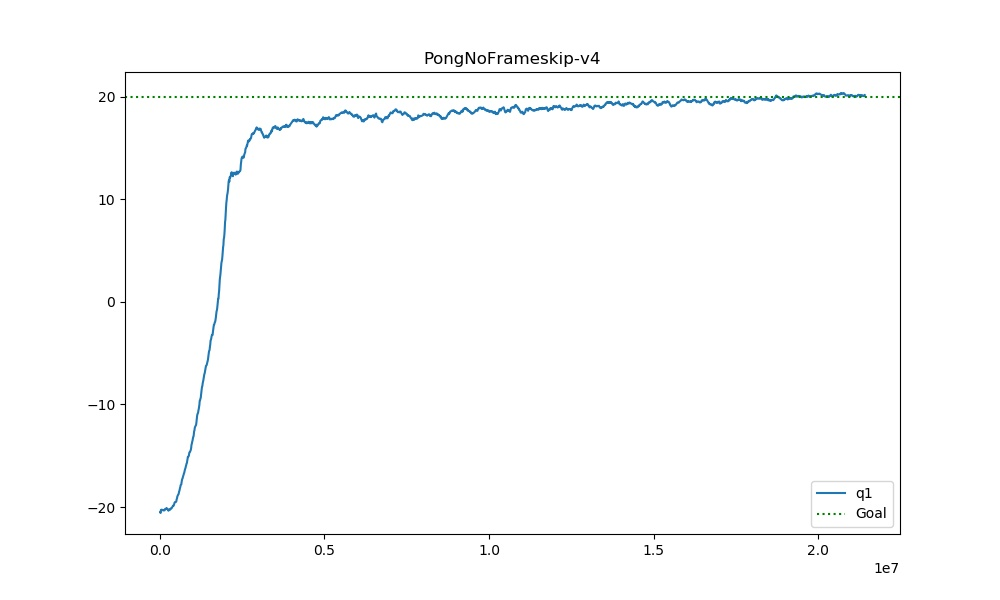
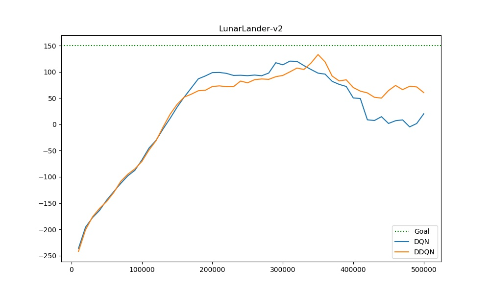
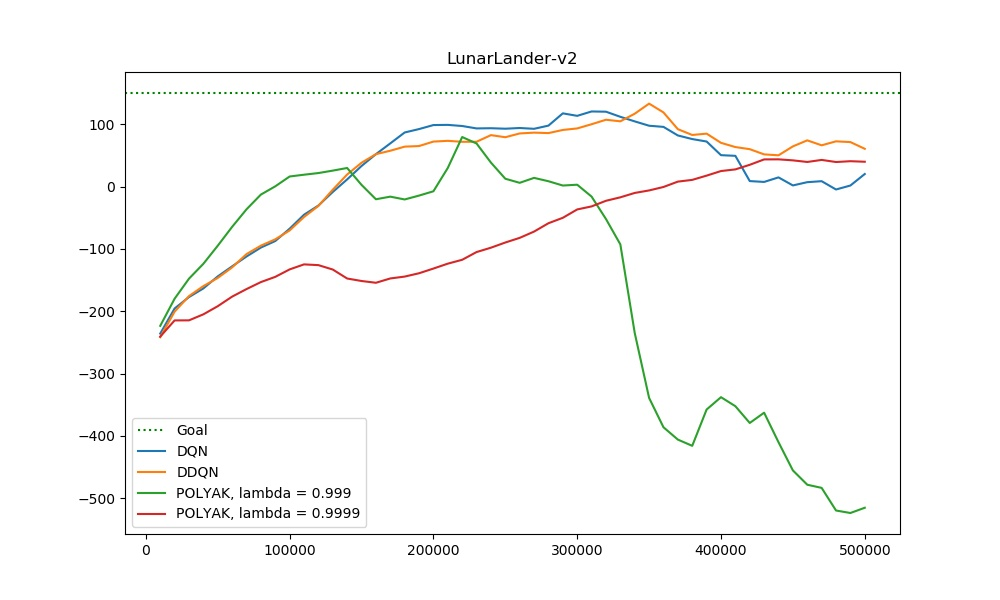
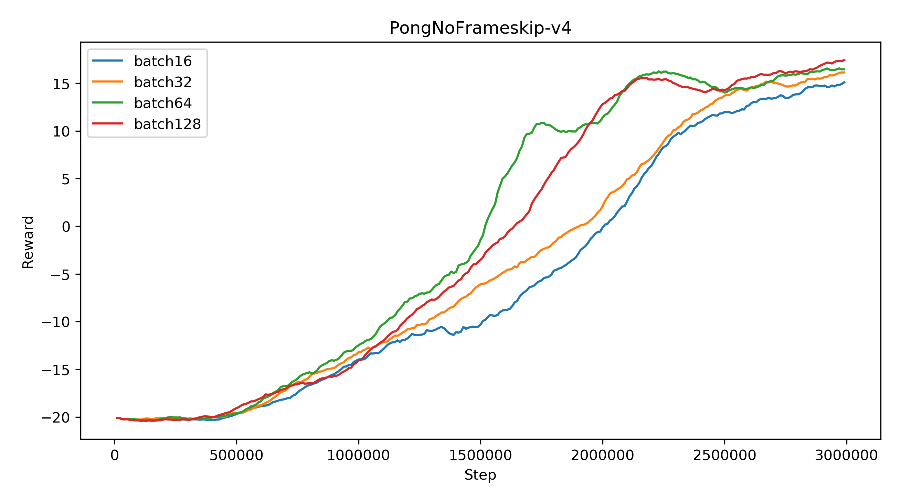
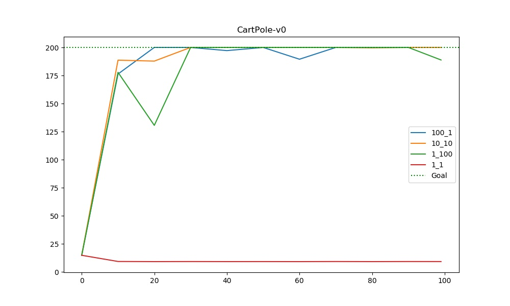
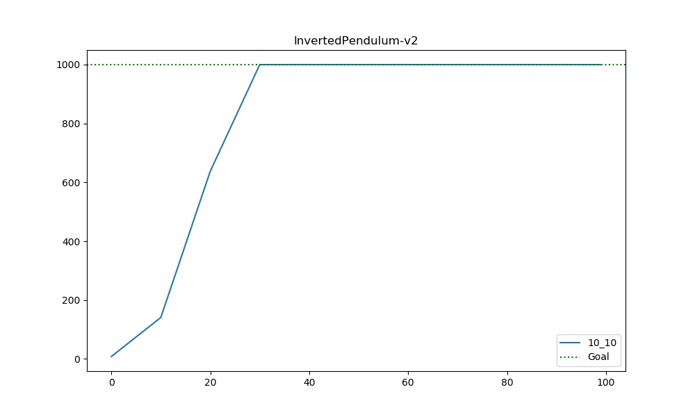
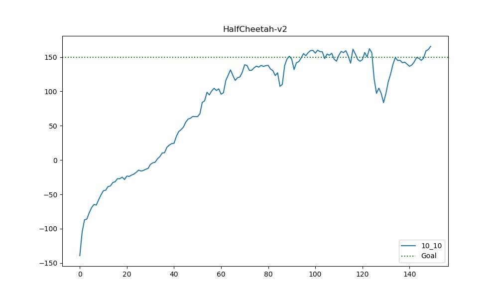

# DQN: Deep Q learning

## (Vanilla) DQN

```bash
python cs285/scripts/run_hw3_dqn.py --env_name PongNoFrameskip-v4 --exp_name q1 --use_gpu
```




## DDQN

```bash
python cs285/scripts/run_hw3_dqn.py --env_name LunarLander-v2 --exp_name q2_dqn_1 --seed 1
python cs285/scripts/run_hw3_dqn.py --env_name LunarLander-v2 --exp_name q2_dqn_2 --seed 2
python cs285/scripts/run_hw3_dqn.py --env_name LunarLander-v2 --exp_name q2_dqn_3 --seed 3

python cs285/scripts/run_hw3_dqn.py --env_name LunarLander-v2 --exp_name q2_doubledqn_1 --double_q --seed 1
python cs285/scripts/run_hw3_dqn.py --env_name LunarLander-v2 --exp_name q2_doubledqn_2 --double_q --seed 2
python cs285/scripts/run_hw3_dqn.py --env_name LunarLander-v2 --exp_name q2_doubledqn_3 --double_q --seed 3
```



- DDQN is good, which might be trained a little more slowly better more stable and better result.
- DQN & DDQN takes much more training steps than PG
- DQN is not stable. Its result might go down even if it have reached a better result.


## POLYAK

```bash
# modify dqn_critic.py
python cs285/scripts/run_hw3_dqn.py --env_name LunarLander-v2 --exp_name polyak_1 --double_q --use_polyak --seed 1
python cs285/scripts/run_hw3_dqn.py --env_name LunarLander-v2 --exp_name polyak_2 --double_q --use_polyak --seed 2
python cs285/scripts/run_hw3_dqn.py --env_name LunarLander-v2 --exp_name polyak_3 --double_q --use_polyak --seed 3
```

- POLYAK might need more time to train.




## Hyperparameter sensitivity

- batch_size

```bash
python cs285/scripts/run_hw3_dqn.py --env_name PongNoFrameskip-v4 --exp_name q3_hparam1 --batch_size 64 --double_q

python cs285/scripts/run_hw3_dqn.py --env_name PongNoFrameskip-v4 --exp_name q3_hparam2 --batch_size 128 --double_q

python cs285/scripts/run_hw3_dqn.py --env_name PongNoFrameskip-v4 --exp_name q3_hparam3 --batch_size 256 --double_q
```




# Actor-Critic

## CartPole

```bash
python cs285/scripts/run_hw3_actor_critic.py --env_name CartPole-v0 -n 100 -b 1000 --exp_name 1_1 -ntu 1 -ngsptu 1
python cs285/scripts/run_hw3_actor_critic.py --env_name CartPole-v0 -n 100 -b 1000 --exp_name 100_1 -ntu 100 -ngsptu 1
python cs285/scripts/run_hw3_actor_critic.py --env_name CartPole-v0 -n 100 -b 1000 --exp_name 1_100 -ntu 1 -ngsptu 100
python cs285/scripts/run_hw3_actor_critic.py --env_name CartPole-v0 -n 100 -b 1000 --exp_name 10_10 -ntu 10 -ngsptu 10
```



- Setting `num_target_updates` and `num_grad_steps_per_target_update` both to be 10 is the best.

- This experiment mainly focus the second step of (batch) actor-critic algorithms (see details in the lecture slides). 
  - In theory, after sampling trajectories (only need transitions here if using bootstrap but still on-policy), we need to estimate our critic's target value (Monto Carlo or Bootstrap) 
  - no matter how we estimate, we need to optimize the critic first before using critic to calculate policy gradient
  - But throughout gradient descent might be costly, so here we only run certain steps.
  - In the other hand, target network shouldn't differ from online network so much (since it's a biased estimation), so we need to periodically re-calculate target value
  - that's why we use `num_target_updates` and `num_grad_steps_per_target_update`.

- Conclusion: the difference between target network and online network should not be far enough and at the same time you need to run several gradient step in get the `best` online network given certain target value. 

- Closer target network is better and more iterations are better (same reason with DQN).

  

## InvertedPendulum

```bash
python cs285/scripts/run_hw3_actor_critic.py --env_name InvertedPendulum-v2 --ep_len 1000 --discount 0.95 -n 100 -l 2 -s 64 -b 5000 -lr 0.01 --exp_name 10_10 -ntu 10 -ngsptu 10
```




## HalfCheetah

```bash
python cs285/scripts/run_hw3_actor_critic.py --env_name HalfCheetah-v2 --ep_len 150 --discount 0.90 --scalar_log_freq 1 -n 150 -l 2 -s 32 -b 30000 -eb 1500 -lr 0.02 --exp_name 10_10 -ntu 10 -ngsptu 10
```

